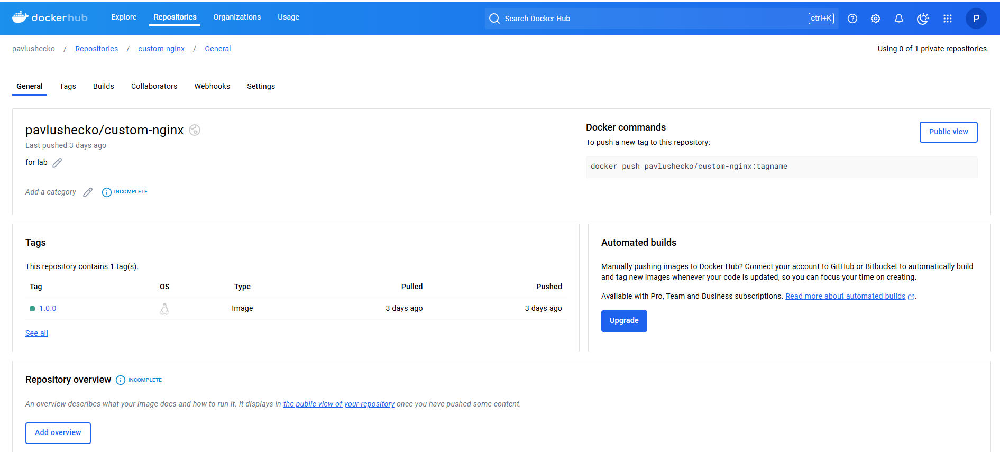
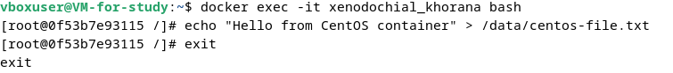

Лабораторная 3

Задание 1

- Собрал и отправил созданный образ в свой dockerhub-репозитории c tag 1.0.0.

Задание 2

- Убедились с помощью веб браузера, что индекс-страница доступна.

Задание 3

После того как я нажал Ctrl-C, контейнер остановился, потому что основной процесс (например, nginx или любой другой сервис) завершился.

- Отредактировал файл "/etc/nginx/conf.d/default.conf", заменив порт "listen 80" на "listen 81".

После изменения конфигурации nginx, порт 80 больше не слушается. Однако контейнер все еще пробрасывает порт 8080 на порт 80 контейнера. Когда мы пытаемся выполнить запросы на порту 8080, nginx продолжает слушать этот порт и отвечает на запросы.

Задание 4

Задание 5

