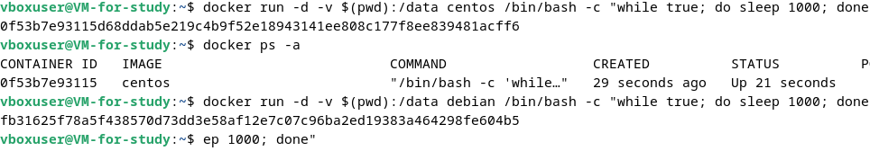
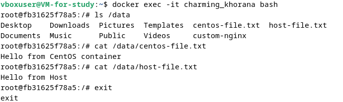
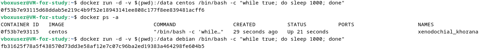

Лабораторная 3

Задание 1

- Собрал и отправил созданный образ в свой dockerhub-репозитории c tag 1.0.0.

Задание 2

- Убедились с помощью веб браузера, что индекс-страница доступна.

Задание 3

После того как я нажал Ctrl-C, контейнер остановился, потому что основной процесс (например, nginx или любой другой сервис) завершился.

- Отредактировал файл "/etc/nginx/conf.d/default.conf", заменив порт "listen 80" на "listen 81".

Ответ: После изменения конфигурации nginx, порт 80 больше не слушается. Однако контейнер все еще пробрасывает порт 8080 на порт 80 контейнера. Когда мы пытаемся выполнить запросы на порту 8080, nginx продолжает слушать этот порт и отвечает на запросы.

Задание 4

Задание 5

1. Создайте отдельную директорию(например /tmp/ZGU/docker/task) и 2 файла внутри него. "compose.

Ответ: Путь по умолчанию для файла Compose — compose.yaml(предпочтительно). Compose также поддерживает docker-compose.yaml для обратной совместимости с более ранними версиями. Если существуют оба файла, Compose предпочитает канонический compose.yaml.

2. Отредактируйте файл compose.yaml так, чтобы были запущенны оба файла. (подсказка: https://docs.docker.com/compose/compose-file/14-include/)

3. Выполните в консоли вашей хостовой ОС необходимые команды чтобы залить образ custom-nginx как custom-nginx:latest в запущенное вами, локальное registry. Дополнительная документация: https://distribution.github.io/distribution/about/deploying/

4. Откройте страницу "https://127.0.0.1:9000" и произведите начальную настройку portainer.(логин и пароль адмнистратора)

5. Откройте страницу "http://127.0.0.1:9000/#!/home", выберите ваше local окружение. Перейдите на вкладку "stacks" и в "web editor" задеплойте следующий компоуз:

6. Перейдите на страницу "http://127.0.0.1:9000/#!/2/docker/containers", выберите контейнер с nginx и нажмите на кнопку "inspect". В представлении <> Tree разверните поле "Config" и сделайте скриншот от поля "AppArmorProfile" до "Driver".

7. Удалите любой из манифестов компоуза(например compose.yaml). Выполните команду "docker compose up -d". Прочитайте warning, объясните суть предупреждения и выполните предложенное действие. Погасите compose-проект ОДНОЙ(обязательно!!) командой.

Ответ: Docker Compose видит контейнер task-portainer-1, который был созданы ранее, но он больше не определены в текущем файле Compose (после удаления файла compose.yaml текущим файлом стал docker compose.yaml). warning предлагает очистить контейнер с помощью --remove-orphans, что мы и делаем. В конце гасим compose-проект с помошью команды down.

Ниже скриншоты консоли:

